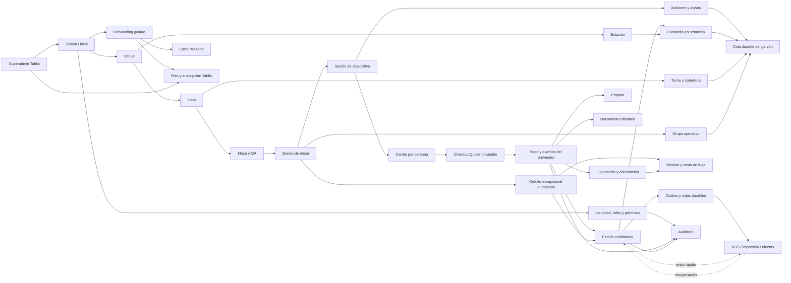

# Mapa de dominios

- **Estado:** vivo y endurecido en Sprint 10; flujo completo del local, crédito excepcional,
  panel del dueño, onboarding, billing SaaS y superadmin implementados con proveedores
  simulados
- **Fuente:** brief v2.2 congelado y decisiones post-freeze

## Regla central

La unidad atómica es:

```text
persona → carrito → CheckoutQuote inmutable → confirmación server-side
        → pedido confirmado → comandas por estación
```

La mesa entrega contexto físico y operativo. No es una cuenta financiera compartida, salvo
cuando un rol autorizado abre explícitamente la excepción de crédito descrita en ADR-008.

## Vista general



## Dominios y responsabilidades

### 1. Tenant y configuración

Representa al comercio cliente. Define identidad, estado, plan, locales, modos de atención,
configuración tributaria, estaciones y capacidades. No hardcodea supuestos exclusivos de bar.

### 2. Espacio físico

Modela locales, zonas, mesas, QRs, códigos de presencia y estaciones. Alimenta operación,
onboarding y futura clasificación de planes por tamaño.

### 3. Identidad, acceso y auditoría

Gestiona comensal, garzón, KDS, cajero/admin, dueño y superadmin. Combina autenticación, roles,
permisos, pertenencia a tenant e historial obligatorio de acciones sensibles.

### 4. Catálogo y disponibilidad

Contiene categorías, productos, variantes, modificadores, precios, impuestos, alérgenos, stock
y asignación a estaciones. Todo es configurable por tenant. El seguimiento unitario es
optativo por producto: sólo los productos con `track_stock` reservan disponibilidad.

### 5. Sesión de mesa y presencia

Abre el contexto físico en el que interactúan varias personas. Valida QR no predecible, código
corto y reglas configurables de presencia. Una sesión contiene dispositivos con token opaco,
alias y carrito independientes. La sesión de dispositivo vence tras 4 horas de inactividad,
12 horas absolutas o antes si la mesa se cierra.

### 6. Carrito y CheckoutQuote

Cada persona tiene su carrito. Antes de pagar se crea un snapshot inmutable con cantidades,
precios, descuentos, impuestos, propina, tenant, mesa, identidad visible y expiración. El quote
vive 10 minutos por defecto y es el único reloj de cualquier reserva asociada.

### 7. Pagos

Normaliza intentos, eventos del proveedor, confirmación verificable, reembolsos y contracargos.
El estado se deriva de eventos inmutables. Cada operación se ejecuta en el comercio directo
del bar; Tablio nunca custodia fondos, cobra una comisión de plataforma ni distribuye ventas.
El proveedor entra mediante `PaymentGateway`.

### 8. Pedidos

Convierte un pago confirmado en un pedido exactamente una vez. Mantiene identidad visible por
persona y una máquina de estados distinta de la sesión, el pago y las comandas. El pedido y sus
comandas iniciales se crean atómicamente antes de avisar al KDS.

### 9. Producción y entrega

Divide un pedido en comandas por estación dentro de la transacción de confirmación. KDS recibe
avisos rápidos, reconstruye su estado desde PostgreSQL y nunca espera a la cola para mostrar
trabajo ya confirmado. Un heartbeat persistido permite saber qué estaciones tenían pantalla
activa al confirmar; sólo esas entregas alimentan p50/p95/p99. La pantalla reconcilia además
cada 45 segundos aunque Realtime parezca conectado y muestra una alerta operativa si deja de
sincronizar.

### 9.1 Acciones de mesa

Las acciones son datos configurables por tenant/venue y aplican cooldown más clave de
deduplicación. “Pagar con el garzón” es sólo una solicitud visible: no crea pedido, comanda ni
estado que parezca pagado.

### 9.2 Servicio y entrega

El garzón abre un turno por PIN, toma zonas y ve una cola reconstruible desde PostgreSQL.
Realtime invalida; inicio, reconexión y sondeo cada 45 segundos recuperan pendientes. Entregar
sólo mueve una comanda READY a COMPLETED; nunca crea pedidos ni confirma pagos.

Una tarea asignada sigue al nuevo garzón al transferir mesa o zona. Sin cobertura, queda
visible para todos y escala a administración. A los 12 minutos cualquier clase vence la
prioridad normal para impedir inanición.

### 9.3 Grupo operativo de mesas

El grupo enlaza sesiones activas sólo para visualización. No altera QR, carritos, quotes,
pagos, pedidos ni comandas y puede separarse sin reescribir historia financiera. Ver ADR-004.

### 9.4 Crédito de mesa excepcional

`tenant_table_credit_settings` parte desactivado y fija límites por mesa/local y vencimiento.
`table_credit_accounts` conserva la autorización y exposición; ledger, vínculos a pedidos,
pérdidas y verificaciones son evidencia durable. Un pedido con `financial_mode=table_credit`
puede entrar a producción sin pago sólo si una cuenta viva lo autoriza dentro de límites.

Prepago y crédito no se compensan: el resumen operacional agrega ventas pagadas de la sesión
y saldo de crédito en columnas separadas. Los pagos parciales reducen sólo el ledger de
crédito. Un cierre con fuga aparece en el snapshot de turno y en la métrica mensual del dueño.
Ver ADR-008.

### 9.5 Panel narrativo del dueño

PostgreSQL calcula ventas, ticket, propinas, rounds, productos, horas, excepciones y fuga antes
de entregarlos. El cliente elige local o consolidado, pero no agrega cifras. Reglas explícitas
convierten esos datos en titular, atención, mejora y recomendación.

Cuando aún no existe período comparable, se muestran ventas del día, productos y excepciones;
un mensaje humano indica desde cuándo se guarda historia y la fecha estimada de la primera
comparación. Nunca se reemplaza información disponible por una pantalla vacía.

### 10. Durabilidad y efectos

Outbox, Supabase Queues, consumidores, reintentos, DLQ, spool de impresión y replay auditado.
`PrinterPort` separa el spool durable del transporte hacia el hardware; hoy existe un stub y
la conectividad física sigue abierta. Realtime acelera la pantalla, pero no es la cola ni la
fuente de verdad.

### 11. Propinas

Separa propina de subtotal e impuestos, conserva su regla de distribución y permite
conciliación/reembolso configurables. Tablio no cobra fee sobre propinas.

### 12. Tributación

Orquesta emisión vía proveedor DTE. Garantiza que una venta no genere dos respaldos tributarios
por el mismo hecho y relaciona notas de crédito con reembolsos/anulaciones.

El puerto `TaxDocumentProvider` mantiene al dominio independiente de LibreDTE, Nubox, Bsale,
Facturación.cl u otro proveedor. Pedido/KDS terminan primero; emisión, consulta, reintento y
nota de crédito viajan por outbox/cola. Una falla tributaria abre una excepción, pero jamás
desconfirma la venta.

Reembolso monetario y nota de crédito son obligaciones separadas. Si el DTE original no sale,
el cliente recibe su devolución y caja conserva una alerta crítica hasta completar el
documento. Caja muestra además salud del proveedor por tasa de fallos y acumulación por
volumen/antigüedad.

### 13. Conciliación

Compara CheckoutQuote/pedido, transacción de pasarela, documento tributario y liquidación real.
Toda diferencia queda como excepción accionable. Una aprobación posterior al vencimiento no
produce: abre una alerta crítica visible al cajero para reembolsar o producir manualmente.

Caja agrega turnos, atribución por hora de aprobación del proveedor, reembolsos auditados y un
snapshot de cierre inmutable. Si no existe un turno que contenga esa hora, la confirmación
queda en una bandeja sin turno, con hora del proveedor y recepción. Los hechos posteriores no
reabren un cierre: generan ajustes append-only.

La propina se prorratea al reembolsar. Mientras el turno de origen está abierto reduce su
distribución; si ya cerró, el trabajador conserva lo recibido y el local absorbe un ajuste
visible en el cierre siguiente, según ADR-005.

### 14. Billing de Tablio

Cobra setup y suscripción SaaS por separado del dinero del bar. La morosidad nunca corta una
noche de alto flujo sin aviso y horario controlado. Usa `SaasBillingProvider`, credenciales,
facturas, intentos y conciliación propios; no reutiliza `PaymentGateway` ni la cuenta de
pasarela de un bar.

Las mesas determinan el plan: Inicial hasta 12, Flujo hasta 30, Alto flujo hasta 60 y luego
Personalizado. Zonas y estaciones sólo hacen subir un nivel si ambas exceden límites generosos.
Precios/cortes siguen como hipótesis comerciales. Los cambios se aplican al ciclo siguiente,
sin retroactividad.

Morosidad y acceso operativo están separados. Avisos, reintentos, gracia y restricción
administrativa no impiden vender ni producir. Suspender pedidos nuevos requiere aviso previo y
horario de bajo tráfico. La PWA recibe sólo disponibilidad y mensaje neutro.

### 15. Onboarding y plataforma

El onboarding guarda progreso por paso, exige revisión humana del menú importado, conecta la
cuenta simulada del bar, crea personal/QRs, ejecuta prueba y habilita producción. Los secretos
reales quedan detrás de referencias Vault.

Superadmin administra tenants, métricas, feature flags, proveedores y soporte. Su identidad es
de plataforma, no de un tenant. Toda impersonación exige motivo y genera doble evidencia
auditable.

## Límites importantes

- Pago, pedido y comanda tienen máquinas de estado separadas.
- Realtime puede perder avisos; PostgreSQL no puede perder el estado confirmado.
- Cada efecto asíncrono acepta mensajes repetidos.
- Todo acceso de negocio se limita por tenant.
- Pasarela, proveedor DTE e impresora se conectan mediante adaptadores reemplazables.
- Pago del comensal al bar y suscripción del bar a Tablio son flujos financieros distintos.
- El orden de ingestión usa el reloj de PostgreSQL; `occurred_at` del proveedor se conserva
  como evidencia, pero no puede hacer retroceder una máquina de estados.
- El alias y nombre opcional se congelan en quote/pedido para que la entrega siga siendo
  inequívoca aunque el dispositivo cambie después.

## Hardening transversal de Sprint 10

No se agregó un dominio nuevo. La carga y el caos atravesaron identidad, catálogo, quote,
pagos, pedidos, KDS, impresión, DTE, caja y RLS como una sola cadena. La condición de éxito fue
que cada pago aprobado conserve exactamente un efecto comercial recuperable, incluso con
duplicados, reinicios o dependencias caídas.

## Transacción de confirmación implementada

```text
evento → persistir evidencia inmutable/deduplicar
       → consultar verdad server-side antes de entrar
       → bloquear intento + quote + reservas
       → validar firma, tenant, comercio, monto, moneda y expiración
       → crear pedido + ítems + comandas + consumir reservas + outbox
       → COMMIT
       → Realtime avisa al KDS; PGMQ garantiza los efectos
```

Un resultado `PENDING` o un retorno del navegador sólo agrega evidencia. Si una validación
comercial falla se crea una excepción idempotente; nunca se crea parcialmente un pedido.

## Decisiones abiertas relacionadas

Ver [`OPEN_ISSUES.md`](OPEN_ISSUES.md): proveedores reales de pasarela/DTE/billing SaaS,
validación comercial de planes, extracción de carta e impresión térmica.

## Identidad recurrente y fidelización

La sesión de mesa sigue siendo anónima. Después del primer pago, el comensal puede aceptar un
perfil seudónimo exclusivo de ese bar. Teléfono/correo verificado es la continuidad principal;
el token sólo acelera el reconocimiento. Un dispositivo compartido muestra `Perfil •NNN`, no
un nombre completo, y exige confirmar “sí” o “no soy yo”.

Un pago confirmado puede generar como máximo la visita configurada. El ledger, no el frontend,
calcula sellos. “Tu de siempre” usa historial real del tenant y sólo ofrece productos
disponibles. El premio entra al quote como ítem `$0`, conserva stock, aparece marcado en KDS y
se reconcilia con referencia/costo opcional. Mensajería a dormidos no pertenece a este sprint:
sólo se materializa el segmento.

```text
pago confirmado → visita idempotente → sello en ledger
token presente  → perfil enmascarado → confirmación de la persona
token perdido   → teléfono/correo → código → mismo perfil y mismos sellos
saldo completo  → reserva premio → quote $0 → pedido/KDS → consumo de sellos
```

## Momento del pago

```text
carrito mutable
  ├─ sugerencia determinista → toque explícito → ítem upsell
  ├─ promoción vigente → versión + descuento congelados
  └─ propina → equipo o worker_id/turno válidos
                    ↓
             CheckoutQuote inmutable
                    ↓ pago confirmado
  pedido propio → comandas inmediatas por estación
  invitación    → espera durable → reclamo → comanda a mesa destino
                               └→ cancelación/vencimiento → reembolso
```

Realtime refresca happy hour y avisos; PostgreSQL conserva precio, estado e idempotencia. Una
invitación no reclamada nunca llega al KDS. La propina usa el trabajador congelado aunque
termine su turno antes del cierre del local.
