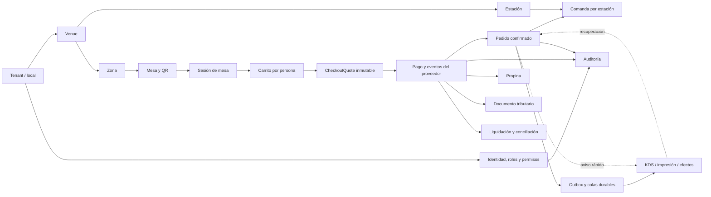

# Mapa de dominios

- **Estado:** vivo, versión inicial de Sprint 0
- **Fuente:** brief v2.2 congelado y decisiones post-freeze

## Regla central

La unidad atómica es:

```text
persona → carrito → CheckoutQuote inmutable → confirmación server-side
        → pedido confirmado → comandas por estación
```

La mesa entrega contexto físico y operativo. No es una cuenta financiera compartida.

## Vista general



## Dominios y responsabilidades

### 1. Tenant y configuración

Representa al comercio cliente. Define identidad, estado, plan, locales, modos de atención,
configuración tributaria, estaciones y capacidades. No hardcodea supuestos exclusivos de bar.

### 2. Espacio físico

Modela locales, zonas, mesas, QRs, códigos de presencia y estaciones. Alimenta operación,
onboarding y futura clasificación de planes por tamaño.

### 3. Identidad, acceso y auditoría

Gestiona comensal, garzón, KDS, cajero/admin, dueño y superadmin. Combina autenticación, roles,
permisos, pertenencia a tenant e historial obligatorio de acciones sensibles.

### 4. Catálogo y disponibilidad

Contiene categorías, productos, variantes, modificadores, precios, impuestos, alérgenos, stock
y asignación a estaciones. Todo es configurable por tenant.

### 5. Sesión de mesa y presencia

Abre el contexto físico en el que interactúan varias personas. Valida QR no predecible, código
corto y reglas configurables de presencia. Una sesión contiene pedidos independientes.

### 6. Carrito y CheckoutQuote

Cada persona tiene su carrito. Antes de pagar se crea un snapshot inmutable con cantidades,
precios, descuentos, impuestos, propina, tenant, mesa, identidad visible y expiración.

### 7. Pagos

Normaliza intentos, eventos del proveedor, confirmación verificable, reembolsos y contracargos.
El estado se deriva de eventos inmutables. Tablio nunca custodia fondos.

### 8. Pedidos

Convierte un pago confirmado en un pedido exactamente una vez. Mantiene identidad visible por
persona y una máquina de estados distinta de la sesión, el pago y las comandas. El pedido y sus
comandas iniciales se crean atómicamente antes de avisar al KDS.

### 9. Producción y entrega

Divide un pedido en comandas por estación dentro de la transacción de confirmación. KDS recibe
avisos rápidos, reconstruye su estado desde PostgreSQL y nunca espera a la cola para mostrar
trabajo ya confirmado.

### 10. Durabilidad y efectos

Outbox, Supabase Queues, consumidores, reintentos, DLQ, spool de impresión y replay auditado.
Realtime acelera la pantalla, pero no es la cola ni la fuente de verdad.

### 11. Propinas

Separa propina de subtotal e impuestos, conserva su regla de distribución y permite
conciliación/reembolso configurables. Tablio no cobra fee sobre propinas.

### 12. Tributación

Orquesta emisión vía proveedor DTE. Garantiza que una venta no genere dos respaldos tributarios
por el mismo hecho y relaciona notas de crédito con reembolsos/anulaciones.

### 13. Conciliación

Compara CheckoutQuote/pedido, transacción de pasarela, documento tributario y liquidación real.
Toda diferencia queda como excepción accionable.

### 14. Billing de Tablio

Cobra setup y suscripción SaaS por separado del dinero del bar. La morosidad nunca corta una
noche de alto flujo sin aviso y horario controlado.

## Límites importantes

- Pago, pedido y comanda tienen máquinas de estado separadas.
- Realtime puede perder avisos; PostgreSQL no puede perder el estado confirmado.
- Cada efecto asíncrono acepta mensajes repetidos.
- Todo acceso de negocio se limita por tenant.
- Pasarela, proveedor DTE e impresora se conectan mediante adaptadores reemplazables.

## Decisiones abiertas relacionadas

Ver [`OPEN_ISSUES.md`](OPEN_ISSUES.md): pasarela primaria, DTE, planes, UX de conexión de
pasarela e impresión térmica.
